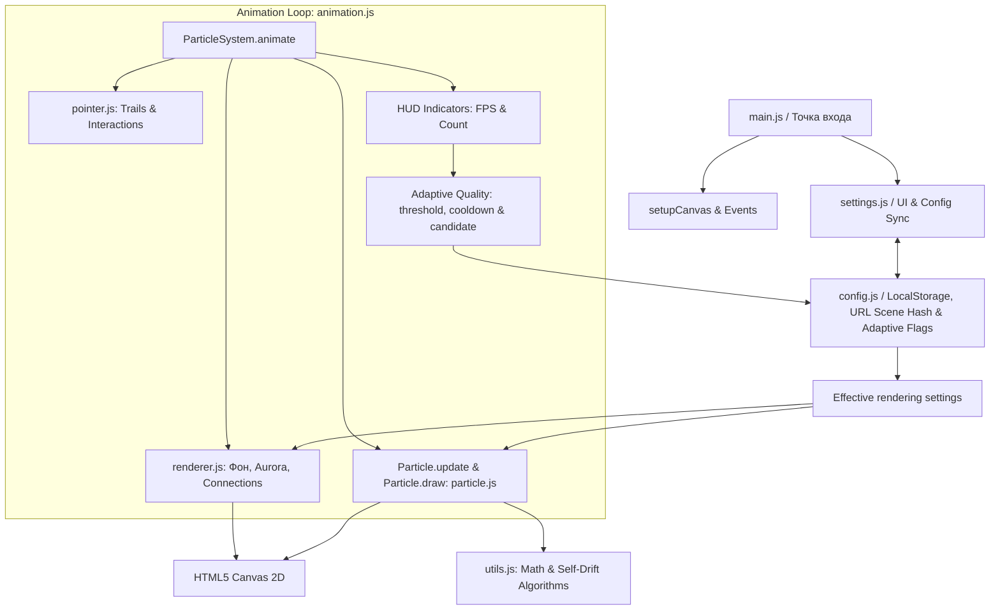

Проект **ParticleFlow** представляет собой интерактивную полноэкранную систему частиц с панелью настроек, поддержкой пресетов, загрузкой/сохранением конфигурации через URL и возможностью работы как PWA (Progressive Web Application).

---

### 1. Архитектурный обзор

Проект написан на **чистом JavaScript (ES6+)** без применения сторонних фреймворков и сборщиков. Отрисовка выполняется с использованием **HTML5 Canvas 2D API**.

* **Архитектурный паттерн**: Модульный монолит на основе паттерна IIFE (Immediately Invoked Function Expression).
* **Глобальное пространство имён**: Все модули расширяют единый объект `window.ParticleSystem`.
* **Поддержка PWA**: Офлайн-режим через Service Worker ([`sw.js`](sw.js)) и возможность установки приложения благодаря [`manifest.json`](manifest.json).

---

### 2. Модульная структура (`js/`)

Код разбит на специализированные модули:

1. **[`js/constants.js`](js/constants.js)**
   * Содержит основные константы системы, перечисления режимов курсора, доступные формы частиц, цветовые палитры и пресеты.
2. **[`js/config.js`](js/config.js)**
   * Содержит конфигурацию по умолчанию ([`ParticleSystem.DEFAULT_CONFIG`](js/config.js:7)) и готовые пресеты (`Calm`, `Neon`, `Storm`, `Minimal`, `Constellation` и др.).
   * Отвечает за сохранение/загрузку настроек из `localStorage`, кодирование/декодирование параметров в URL hash (`#scene=...`) и хранение флагов адаптивного качества.
   * Хранит последний изменённый тяжёлый параметр в отдельном ключе localStorage; runtime overrides остаются временным общим механизмом, но адаптивные снижения записываются напрямую в `userConfig`.
3. **[`js/utils.js`](js/utils.js)**
   * Вспомогательные математические функции (генерация случайных чисел, конвертация HSL/RGB, расчёт дистанций).
   * Реализует математику для **13 режимов само-дрейфа** частиц (`random`, `horizontal`, `vertical`, `orbit`, `wave`, `spiral` и т.д.).
4. **[`js/particle.js`](js/particle.js)**
   * Содержит классы [`Particle`](js/particle.js:9) и `ExplosionParticle`.
   * Определяет состояние частицы (координаты `x`, `y`, скорости `vx`, `vy`, базовый размер, цвет, след).
   * Логика физики: обновление позиции, взаимодействия с курсором (притяжение, отталкивание, орбита), отражение от границ экранов и отрисовка 15 разных геометрических форм.
5. **[`js/renderer.js`](js/renderer.js)**
   * Модуль отрисовки сцены: заливка фона (сплошной / градиент / прозрачный), кэширование градиентов, визуализация эффекта Northern Lights (Aurora), соединительных линий между близкими частицами и следов указателя.
6. **[`js/pointer.js`](js/pointer.js)**
   * Обработка пользовательского ввода: отслеживание координат мыши и сенсорных касаний (Touch events), а также генерирование следов за курсором.
7. **[`js/settings.js`](js/settings.js)**
   * Управление UI панели настроек: двухстороннее связывание элементов формы (слайдеры, селекты, чекбоксы) с объектом `config`.
   * Обрабатывает toggle адаптивного качества, ручное изменение тяжёлых параметров, синхронизацию контролов и сброс состояния.
   * Поддержка жестов свайпа для скрытия панели и клавиатурной навигации (Focus Trap).
8. **[`js/animation.js`](js/animation.js)**
   * Главный анимационный цикл [`ParticleSystem.animate()`](js/animation.js:11), работающий через `requestAnimationFrame`.
   * Подсчёт показателей производительности (FPS), счетчик общего числа активных частиц на экране и менеджер адаптивного качества.
   * Менеджер отслеживает низкий FPS, выбирает кандидата по приоритету, снижает настройку, обновляет связанные runtime-объекты и уведомляет пользователя.
9. **[`js/main.js`](js/main.js)**
   * Точка входа приложения: регистрация слушателей событий (`resize`, `visibilitychange`, `keydown`), инициализация холста и запуск анимации.

---

### 3. Диаграмма архитектуры и потока данных

---

### 4. Особенности реализации и оптимизации

* **Spatial Hash Grid для соединений**: В [`ParticleSystem.drawConnections()`](js/renderer.js:78) пространство разбивается на сетку ячеек размером `connectionDistance`. Это снижает сложность проверки расстояний между частицами с `O(N²)` до `O(N)`.
* **Кэширование градиентов**: Градиент фона пересчитывается только при изменении цвета или размера окна в [`ParticleSystem.renderBackground()`](js/renderer.js:16).
* **Энергосбережение**: При смене активной вкладки анимация приостанавливается с помощью [`visibilitychange`](js/main.js:58) для экономии ресурсов GPU/CPU.
* **Поддержка High-DPI (Retina)**: Холст масштабируется с учётом `window.devicePixelRatio` для четкого отображения на экранах с высокой плотностью пикселей.
* **Автоматическое разрешение конфликтов**: Тяжёлые графические эффекты (например, `shadowBlur` и `trailEnabled`) взаимно исключаются при выборе пресетов для сохранения высокой частоты кадров.